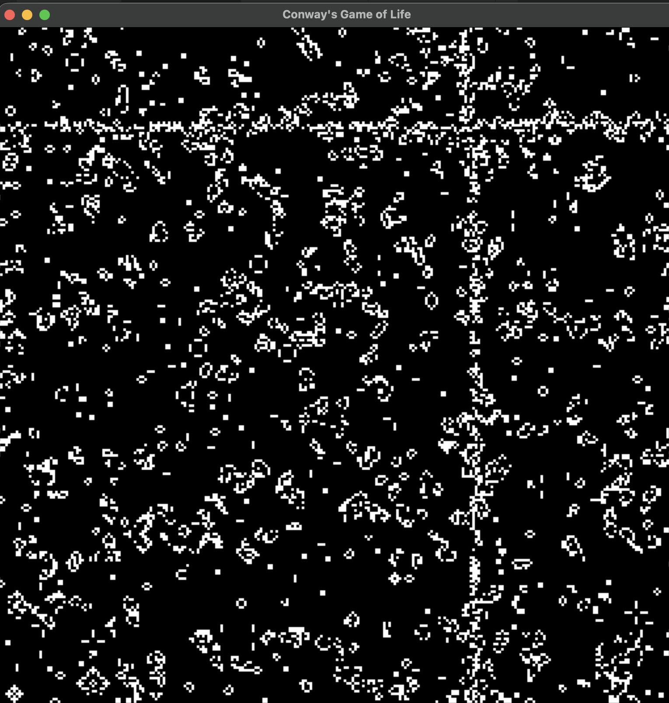

### APPiL

APPiL is a domain-specific language (DSL) for array programming, loosely inspired by languages such as APL and NumPy. The APPiL compiler takes tensor expressions written in a “.appil” file and generates QASM assembly code targeting the VideoCore IV 3D QPU. In addition, it produces accompanying .h and .c files that contain helper mailbox code required to execute the QASM program on a Raspberry Pi’s QPU. As a result, APPiL-generated code can be used as a library to run tensor programs directly on the QPU.


### Language Description

The APPiL Language supports higher-order ‘N’ dimensional Tensors. APPiL programs begin with tensor definitions, which specify their shapes. The APPiL program’s last statement specifies the QPU kernel to be generated. APPiL supports elementwise operations on multiple tensors and also supports slicing of the input/output tensors. It also supports scalar arithmetic broadcasting operations. It does not support general tensor broadcasting and reduction operations. It also does

### Example APPiL program to grayscale and RGB image


```
R = makeTensor(1024, 1024) // input tensors
G = makeTensor(1024, 1024)
B = makeTensor(1024, 1024)
alpha = makeScalar(0.3)    
beta  = makeScalar(0.59)
theta = makeScalar(0.11)
Grey = makeTensor(1024, 1024)  // output tensor

Grey = alpha*R + beta*G + theta*B    // Tensor Expression to compute
```


### Setup.

1. This project uses the [CMake](https://cmake.org/) build system. On macOS,
```bash
brew install cmake
```

2. Build `rpi-qpudsl`:

```bash
# Option 1: normal
cmake -S . -B build
cmake --build build -j<N PARALLELISM>

# Option 2: debug
cmake -S . -B build-dbg -DCMAKE_BUILD_TYPE=Debug
cmake --build build-dbg --config Debug -j<N PARALLELISM>
```

3. Run

```bash 
./build/dsl <.appil file> [output_directory]
```

### Example running game of life demo 

```bash
chmod +x my-install
./run.sh <Program Name (game-of-life)> [Cell Size (Number)]
[!NOTE]
> Baud Rate must be 460800 (must use --baud 460800 for my-install commands)
```

```bash
bash run.sh game-of-life 3
```

